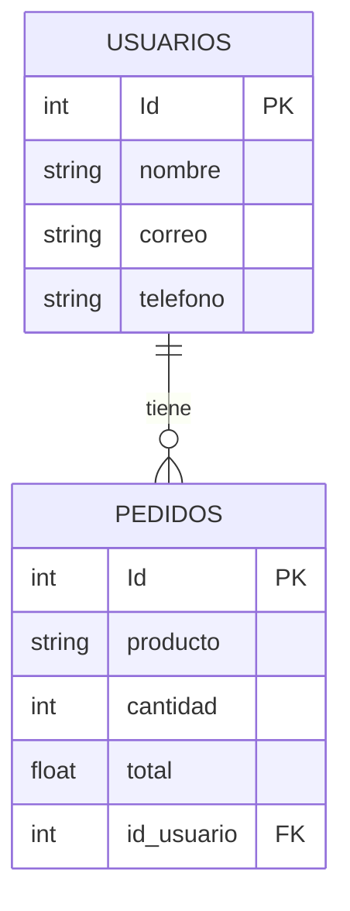

# Pedidos You

Es un proyecto que implementa consultas a una base de datos MySQL con consultas de Query Builder, basado en el diagrama de entidad-relación mostrado abajo. El objetivo es gestionar los datos relacionados a los pedidos de productos de los usuarios.

## Diagrama Entidad-Relación

## Documentación de Postman de la API
La documentación de Postman se encuentra en el siguiente enlace: [Documentación de Postman](https://documenter.getpostman.com/view/21524567/2sA3e5cTCv)

### License

El proyecto es de código abierto licenciado [GPL-3.0 license](https://www.gnu.org/licenses/gpl-3.0.html).
